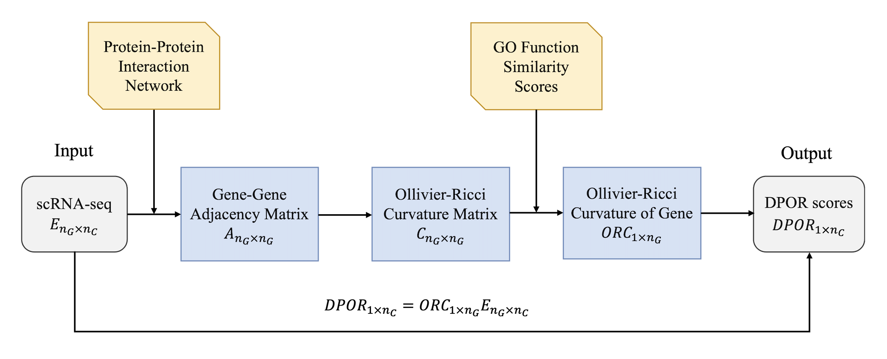

# DPOR: Differentiation Potency predictor using Ollivier-Ricci curvature
  


  
DPOR is performed as follows:  

>(1) Obtainment of expression matrix and adjacency matrix from scRNA-Seq data and PPI network;

>(2) Computation of Ollivier Ricci Curvature(ORC) based on adjacency matrix;

>(3) Assignment of functional similarities between genes to ORC as weights;

>(4) Combination of weighted ORC with expression matrix.

Note: Conversion of human homologous genes is involved when dealing with mouse data.


## Requirements 

- R(4.2.1): AnnotationDbi, preprocessCore, homologene, org.Hs.eg.db, org.Mm.eg.db, igraph

- Python(3.9.6): pandas, numpy, networkx, GraphRicciCurvature


## Getting Started

Clone this repository via the commands:

```
git clone https://github.com/cliffgao/DPOR.git
cd DPOR
```


## R Packages installing

Install relevant R packages:

```
source("code/environment.R")
```


## Two examples

If you want to use original datasets as input, please follow:  

- input: scRNA-Seq Profile (rows are genes and columns are cells)
- output: DPOR scores for cells

```
source(examples/example_Chu1.R)    # for huamn datasets
source(examples/example_Briggs.R)  # for mouse datasets
```


## Two interface

If you want to use the processed data provided by us as input, please follow:  

- input: Ollivier-Ricci Curvature(ORC) matrix, expression matrix
- output: DPOR scores for cells

```
source(interface/CompDPOR_Hs.R)  # for huamn datasets
source(interface/CompDPOR_Mm.R)  # for mouse datasets
```
